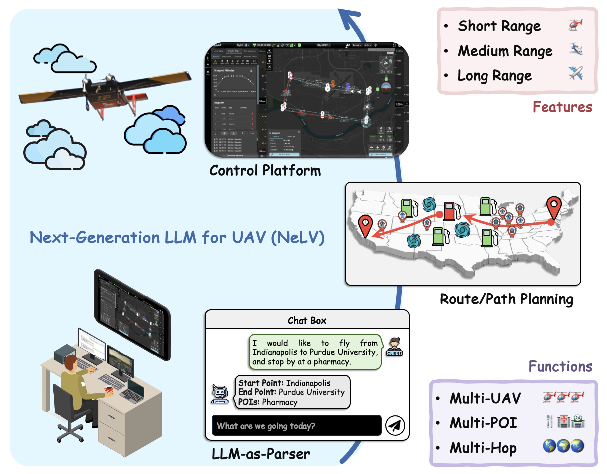
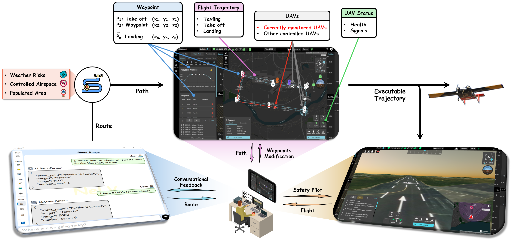

# Next-Generation LLM for UAV

[](https://www.python.org/downloads/)
[](https://opensource.org/licenses/MIT)
[](https://arxiv.org/abs/2025.xxxxx)

## 🌐 Project Page: [https://liangqiyuan.github.io/NeLV/](https://liangqiyuan.github.io/NeLV/)

The **Next-Generation LLM for UAV (NeLV)** system is a comprehensive full-stack framework that encompasses the entire operational pipeline from human instruction input to UAV flight mission execution.
<div align="center">
    
</div>

## 🔥 System Overview

NeLV processes natural language instructions to orchestrate multi-scale UAV missions through five key technical components:
1. **🧠 LLM-as-Parser**: Interprets natural language instructions and extracts mission parameters
2. **🗺️ Route Planner**: Determines optimal Points of Interest (POI) based on mission requirements
3. **📍 Path Planner**: Generates detailed waypoint sequences considering airspace and weather
4. **🎮 Control Platform**: Creates executable trajectories with take-off/landing patterns
5. **📡 Real UAV Monitoring**: Provides real-time flight monitoring and intervention capabilities

<div align="center">
    
</div>

## 🎯 Use Cases

We demonstrate NeLV's capabilities through three representative scenarios:

### 🔍 Use Case 1: Short-Range Multi-UAV Patrol
- **Mission**: Forest surveillance within 5km radius
- **Dataset**: OpenStreetMap data
- **Features**: Five UAVs executing coordinated patrol patterns

### 📦 Use Case 2: Medium-Range Multi-POI Delivery
- **Mission**: Supply delivery with multiple locations
- **Dataset**: Yelp Open Dataset
- **Features**: Multi-objective optimization and loiter patterns

### ✈️ Use Case 3: Long-Range Multi-Hop Relocation
- **Mission**: Transcontinental flight (New York to Los Angeles)
- **Dataset**: AirNav airport and fuel data
- **Features**: Multi-hop flight with strategic refueling stops

*See [Project Page](https://liangqiyuan.github.io/NeLV/) for demos and videos.*

## 🚀 Quick Start

### Prerequisites

```bash
pip install -r requirements.txt
```

**Note**: Windows OS required due to PyQt5 library dependencies.

### Installation

```bash
git clone https://github.com/liangqiyuan/NeLV.git
cd NeLV
pip install -r requirements.txt
```

### Basic Usage

```bash
# Launch the NeLV system
python main.py
```

## 📁 Project Structure

```
NeLV/
├── README.md
├── requirements.txt
├── main.py                     # Main entry point
├── utils_route_short.py        # Short-range multi-UAV patrol route planning
├── utils_route_medium.py       # Medium-range multi-POI delivery route planning
├── utils_route_long.py         # Long-range multi-hop relocation route planning
├── utils_path_plan.py          # Route to path conversion
├── utils_control_platform.py   # Path to executable trajectory generation
├── examples/                   # Pre-configured use cases for convenient testing
│   ├── long_range.json
│   ├── medium_range.json
│   └── short_range.json
└── data/                       # Integrated datasets (Yelp, airports, etc.)
```

## 📊 Datasets

NeLV integrates with multiple data sources:

- **🗺️ OpenStreetMap**: Geospatial information and POI data
- **🏢 Yelp Open Dataset**: Business locations and ratings
- **✈️ AirNav**: Airport information and fuel prices
- **🌤️ HRRR Weather**: High-resolution meteorological data
- **🛡️ OpenAIP**: Airspace restrictions and regulations

## 📄 Citation

If you use NeLV in your research, please cite our paper:

```bibtex
@article{yuan2025nelv,
  title={Next-Generation LLM for UAV: System Design, Real Implementation, Case Study, and Future Direction},
  author={Yuan, Liangqi and Deng, Chuhao and Han, Dong-Jun and Hwang, Inseok and Brunswicker, Sabine and Brinton, Christopher G.},
  journal={arXiv preprint arXiv:2025.xxxxx},
  year={2025}
}
```
